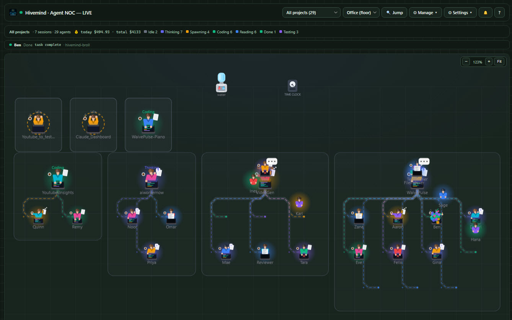
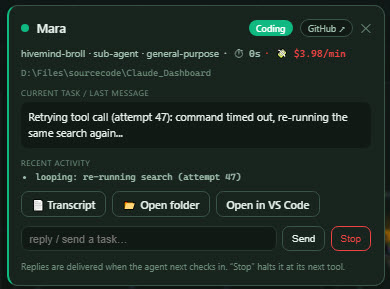
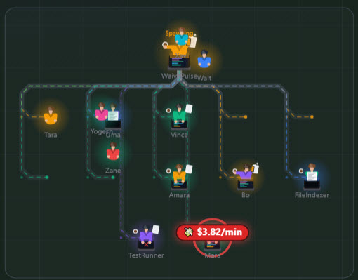
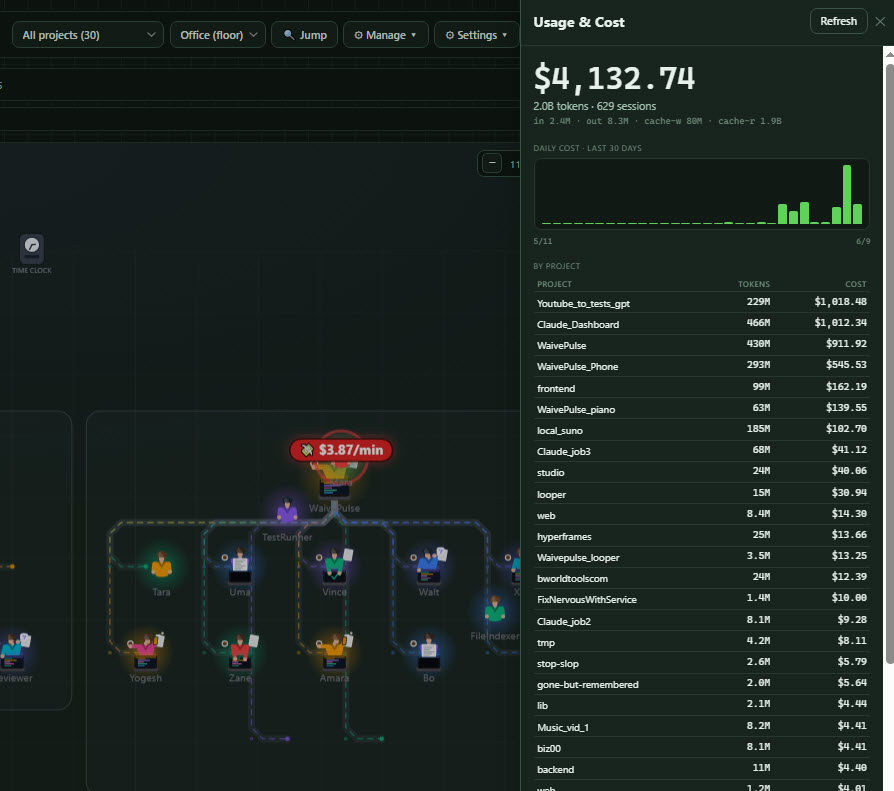

<p align="center"></p>

# Hivemind

> *Agent Ops Center* — a NOC for everything your Claude Code agents are doing.

A live, animated dashboard of your **Claude Code agents and sub-agents** — a Hollywood-Squares / Zoom-style grid where each agent is a pixel-art avatar that physically acts out what it's doing: thinking, reading, coding, spawning sub-agents, running tests, erroring, idling. Parent and child agents are linked with curved connectors carrying **animated packets that flow downward** to show information moving through the hierarchy.

It attaches to any project automatically via Claude Code **hooks** — no manual wiring once installed.

<p align="center"></p>
<p align="center"><em>idle · thinking · coding · spawning · reading · testing · error · done — every agent, live.</em></p>

<p align="center"><a href="https://www.paypal.com/ncp/payment/G8NNLNUHD6SFW"></a></p>

## What you get

- **Live agent tiles** — one per session/sub-agent, driven by real tool activity.
- **Persistent Orchestrator root** — the main session is always present (idle when quiet) as the root of the tree.
- **Recursive hierarchy view** — connectors from each agent to its sub-agents at any depth, with subtree hover-highlight and animated parent→child flow.
- **Office floor + Mosaic views** — a top-down animated office where agents walk, gather at the water cooler, and route packets to their sub-agents; or a compact responsive tile grid.
- **3 avatar tiers** — pixel art (procedural Canvas), abstract (waveforms/EQ/rings), and top-down desk people / your own images.
- **Click any agent** — a modal to read its current task, reply, stop it, or open its folder / VS Code.
- **Live cost + runaway alerts** — each agent tile shows its session spend, and any agent burning money fast (a stuck/looping session) lights up red with a `💸 $/min` badge so you can catch it and stop it before it runs up a bill. Toggle off in Settings if you don't care about spend.

## Control center — manage Claude Code, not just watch it

Beyond visualization, Hivemind is a local control panel for everything Claude Code on your machine (top-bar buttons):

- **Projects** — every Claude project (running, recently active, or discovered from folders you add — typed or via a native picker) with the components each uses: skills, agents, commands, hooks, MCP servers. Copy any component between projects (or to/from your global `~/.claude`, with an overwrite confirm); see per-project **git status** (branch · dirty · ahead/behind); **▶ Start** a session, **Pull**, or **Commit & Push** in place.
- **Usage** — token & cost analytics parsed from your `~/.claude` transcripts (including sub-agent sessions): total spend, 30-day chart, per-project / per-model breakdowns, priciest sessions. Today's + total spend also show live in the status bar.
- **GitHub** — open PRs and issues per project via the `gh` CLI, click to open in the browser.
- **Config** — view a project's hooks, MCP servers, and raw `settings.json`; delete a hook event or MCP server.
- **History** — recent sessions across all projects with their first prompt; **▶ Resume** any one (`claude --resume <id>` in a terminal) or copy the command.
- **Telegram** — get pinged when a session is waiting on you, and reply or `/stop` from your phone.

## Screenshots

<p align="center"></p>
<p align="center"><em>The Office floor — many live Claude Code sessions at once, each in its own room. Idle agents drift to the water cooler and clock out.</em></p>

<p align="center">
  
  &nbsp;
  
</p>
<p align="center"><em>Click any agent to read its task, reply, or stop it — with live $/min burn, a GitHub link, and open-in-VS-Code (left). An agent stuck in a retry loop lights up red with a 💸 $/min badge so you can catch it (right).</em></p>

<p align="center"></p>
<p align="center"><em>Usage &amp; cost — real spend parsed from your <code>~/.claude</code> transcripts: total, 30-day chart, and per-project / per-session breakdowns.</em></p>

## Install

**Requirements:** [Node.js](https://nodejs.org) and Claude Code.

### One-step setup (recommended)

Clone the repo, then from the Hivemind folder run the setup script for your OS:

```bash
# Windows
setup.bat                  # global: every Claude session on this machine reports in
setup.bat --project        # only sessions started in this folder

# macOS / Linux
./setup.sh                 # global   (use --project to scope to this folder)
```

It checks for Node, wires Hivemind's hooks into your Claude Code `settings.json` (without touching your other settings), and prints the next steps. The dashboard is **prebuilt** (`dashboard/dist`) — nothing to compile just to run it.

Prefer to do it by hand? The setup scripts just call the installer:

```bash
node install.js            # global   (or: node install.js --project)
```

Then, in any open session run `/hooks` (or restart) to load the hooks. To remove everything:

```bash
node uninstall.js          # or: node uninstall.js --project
```

### Optional setup

These are configured from the dashboard's **Manage → Config** panel (saved to `bridge/aoc-config.json`):

- **Telegram** — paste a bot token + your chat id to get pinged when a session needs you, and reply or `/stop` from your phone.
- **Cost budget** — a daily / per-session spend cap that alerts via banner + Telegram.
- **Open-in-editor command** — only if "Open in VS Code" can't auto-detect your editor; point it at `code.cmd`, `codium`, etc.
- **Idle nudge** — wake parked sessions so a queued reply delivers immediately. Set up the scheduled task with `scripts/nudge-idle.ps1` (Windows — run it hidden via `scripts/nudge-idle-hidden.vbs`) or `scripts/nudge-idle.sh` (macOS/Linux cron), then enable **"Wake on send"** in Config to fire it the moment you reply.

### Develop / rebuild the dashboard

Only needed if you change the UI (`web/src`):

```bash
cd web && npm install && npm run build   # outputs to dashboard/dist (what the bridge serves)
cd web && npm run dev                    # hot-reload dev server
```

### Alternative: as a Claude Code plugin

```
/plugin marketplace add <this-repo-or-path>
/plugin install hivemind@hivemind
```

Either way, on your next session the `SessionStart` hook starts the bridge and opens the dashboard at `http://localhost:3131/`. As Claude works, tiles light up automatically — and you can **send messages or stop** any session right from its tile.

### How the automatic wiring works

| Hook | Effect on the dashboard |
|------|-------------------------|
| `SessionStart` | Launches the bridge (`bridge/launch.js`) and opens the dashboard once |
| `UserPromptSubmit` | Orchestrator → thinking |
| `PostToolUse` | Maps the tool to a state (Read/Glob→reading, Write/Edit→coding, Bash→coding/testing, Task→spawning, …) |
| `PostToolUseFailure` | → error |
| `SubagentStart` / `SubagentStop` | Creates a child tile (spawning) / marks it done |
| `Stop` / `SessionEnd` | Orchestrator → idle |

All event hooks are `type: "http"` posting to `http://localhost:3131/api/hook`, which maps the raw payload to agent updates — cross-platform, no scripts.

## Manual control

Use the `/agent-ops` skill, or:

```bash
node bridge/launch.js                      # start bridge + open dashboard (idempotent)
curl -s http://localhost:3131/api/state    # status
curl -s -X POST http://localhost:3131/api/reset   # clear tiles
```

### Drive it from a headless run (no plugin/hooks)

```bash
claude -p "task" --output-format stream-json --verbose | node bridge/server.js --stdin
# or let the server spawn the run itself:
node bridge/server.js --run "claude -p 'task' --output-format stream-json --verbose"
```

## Architecture

```
.claude-plugin/
  plugin.json          # plugin manifest
  marketplace.json     # distribution manifest
hooks/
  hooks.json           # SessionStart launches the bridge; tool/Stop/Notification → emit.js
  emit.js              # forwards hook payloads to the bridge (+ command return channel, last-message capture)
bridge/
  server.js            # zero-dep HTTP server: serves the dashboard + the event/command/inspect API
  parser.js            # stream-json → agent events (for the --stdin / --run pipeline)
  launch.js            # cross-platform idempotent launcher
  license.js           # optional Gumroad license verification
  projects.js          # project registry: discover projects + components, copy between them
  git.js               # per-project git status (branch/dirty/ahead/behind)
  usage.js             # token/cost analytics from ~/.claude transcripts
  github.js            # PRs/issues via the gh CLI
  configmgr.js         # read/delete hooks + MCP servers in a project
  history.js           # recent resumable sessions
web/                   # Svelte 5 + Vite dashboard SOURCE
  src/App.svelte, src/lib/*.svelte, src/lib/*.js
  src/lib/{ProjectsSidebar,CostPanel,GithubPanel,SettingsPanel,HistoryPanel}.svelte  # control-center panels
  -> `npm run build` outputs to dashboard/dist (what the bridge serves)
dashboard/dist/        # built dashboard (shipped)
skills/
  agent-ops/SKILL.md   # manual control skill
install.js, uninstall.js   # merge/remove the hooks in settings.json
```

The bridge + hooks stay small, readable Node (they run on every tool call on the user's machine); the dashboard is a compiled Svelte app. Rebuild the UI with `cd web && npm run build` (or `npm run dev` for hot-reload).

### Event API

```
GET  /api/state      -> { agents:[...], projects:[...], muted:[...], pending:{} }
GET  /api/license    -> { licensed, mode, ... }
GET  /api/inspect?session=<id>  -> { cwd, subagents, skills, agents, hooks }
POST /api/event      -> { agentId, name?, state?, parentId?, project?, cwd?, log?, remove? }
POST /api/hook       -> raw Claude Code hook payload (mapped automatically)
POST /api/command    -> { sessionId, type:"message"|"stop", text }   (delivered via hook return channel)
POST /api/mute       -> { project, muted }
POST /api/reset      -> clear registry

# Control center
GET  /api/projects        -> { roots, projects:[{path,name,running,skills,agents,commands,hooks,mcp}] }
POST /api/projects/roots  -> { action:"add"|"remove", path }
POST /api/pick-folder     -> native folder picker (Windows); registers a project root
POST /api/copy-component  -> { type:skill|agent|command|hook|mcp, name, fromCwd, toCwd, overwrite? }
POST /api/git-status      -> { paths:[...] } -> path -> { branch, dirty, ahead, behind, remote, lastWhen }
POST /api/git-action      -> { cwd, action:pull|fetch|commit-push, message? }
POST /api/launch          -> { cwd, resume? }   (opens a terminal running claude)
POST /api/open            -> { cwd, target:"folder"|"editor" }
GET  /api/usage           -> token/cost summary from transcripts
POST /api/github          -> { cwd, kind:info|prs|issues }
POST /api/config-read     -> { cwd } -> { hooks, mcp, settingsRaw, ... }
POST /api/config          -> { cwd, action:delHook|delMcp, name }
GET  /api/history         -> recent sessions [{ sessionId, project, firstPrompt, resumeCmd, ... }]
```

States: `idle · thinking · coding · spawning · reading · testing · error · done · awaiting`.

## Configuration

`bridge/aoc-config.json` (gitignored) or env vars:

- **Port** — `AOC_PORT` (default `3131`).
- **Telegram alerts/replies** — `{ "telegramToken": "...", "telegramChatId": "...", "dashboardUrl": "..." }` (or `AOC_TG_TOKEN` / `AOC_TG_CHAT` / `AOC_DASH_URL`). For inbound replies, the bot must have no webhook — use a dedicated bot via `"telegramReplyToken"` if needed.
- **Avatar images** — imported from the dashboard (**Images…** / **Action images…**), stored in the browser's localStorage.
- **Runaway burn threshold** — `{ "burnAlert": 1.0 }` ($/min). Any active session spending faster than this gets the red "runaway" highlight (default `1.0`). The visual itself can be toggled per-browser in Settings → *Cost & burn alerts*.
- **Claude command / path** — `{ "claudeCmd": "" }`. The **▶ Start** / Resume buttons run `claude` (on PATH) by default. If you get *"'claude' is not recognized"*, set this to the full path to the CLI — find it with `where claude` (Windows) / `which claude` (macOS/Linux), e.g. `C:\Users\you\.local\bin\claude.exe`. Also settable from Settings → *Claude command / path*.

## Support

Hivemind is free and always will be. If it saves you time (or money), you can [**buy me a coffee** ☕](https://www.paypal.com/ncp/payment/G8NNLNUHD6SFW) — and a ⭐ on the repo genuinely helps.

## License

**MIT** — free and open source. Use it, fork it, ship it. Issues and PRs welcome.
